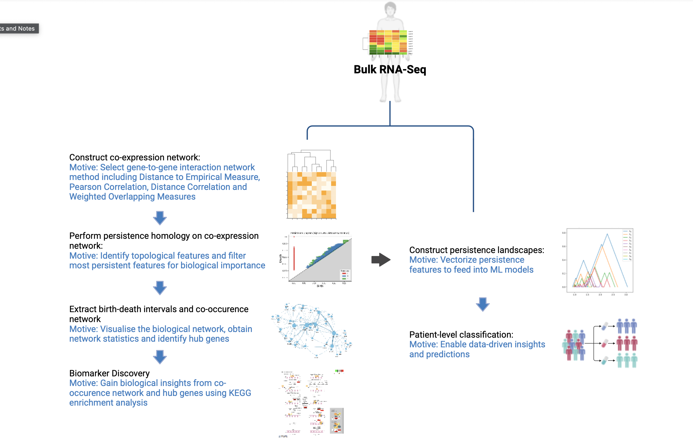
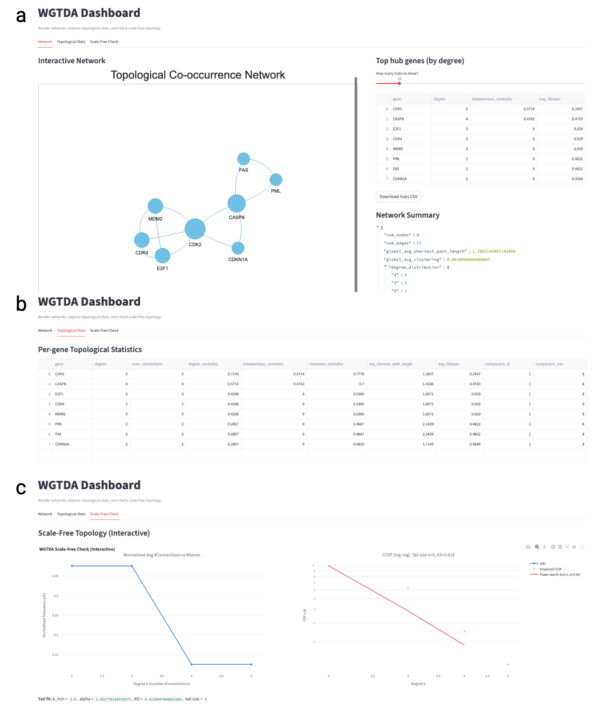
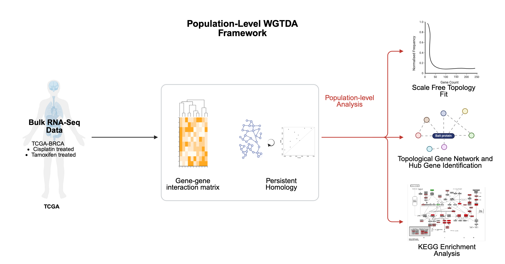
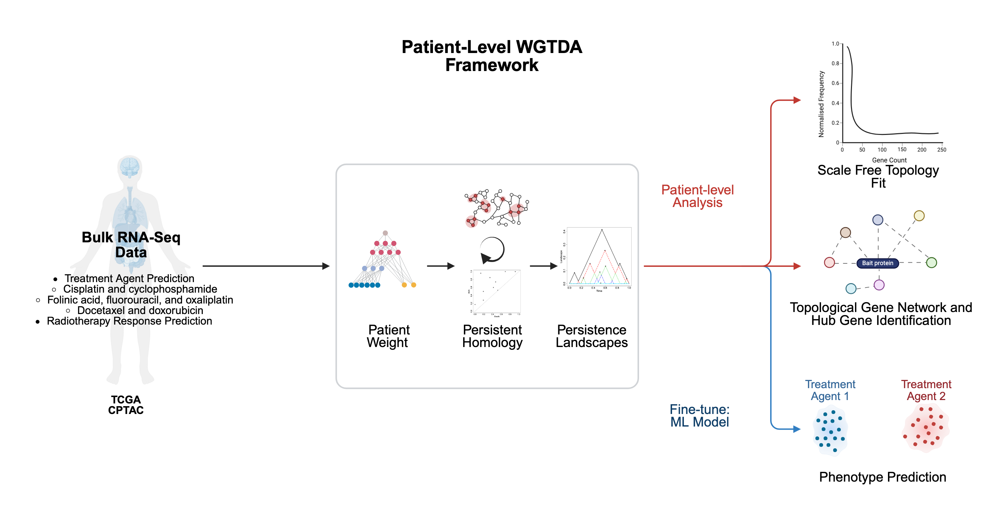

[](https://github.com/psf/black)


[](https://arxiv.org/abs/2402.08807)


# WGTDA (Weighted Gene Topological Data Analysis)

WGTDA is a framework for topological biomarker discovery, network analysis, and classification using persistent homology applied to gene co-expression structures.
It enables researchers to uncover higher-order gene–gene interaction motifs that are not detectable through classical statistics or machine learning alone.

This repository provides:

- Biomarker discovery pipeline → Generates persistent interactions and co-occurrence networks.

- Prediction pipeline → Uses topological embeddings (e.g., persistence landscapes) for classification.

- Interactive Streamlit dashboard → Visualize WGTDA networks, hub genes, and scale-free topology.




### Repo Structure 

WGTDA/
│
├── wgtda_discovery.py         # Biomarker discovery pipeline (interactions.csv)
├── wgtda_prediction.py        # TDA landscape-based classification
├── wgtda_app.py               # Streamlit dashboard
│
├── src/
│   ├── correlation/           # DTEM, wTO, Pearson, DC computation
│   ├── tda/                   # Rips complex, persistence, biomarker pipeline
│   ├── web_app/               # Visualization + network stats
│   └── filters/               # Lifespan filtering for interactions
│
├── interactions/              # stored interactions CSVs
└── README.md

## 1. Biomarker Discovery Pipeline



This pipeline generates:

- Persistence diagrams

- Topological interaction tables (interactions.csv)

- Genesets for hubs and cycles

- WGTDA co-occurrence network

```bash 
python wgtda_discovery.py -p data/treatment_response/cptac_radiotherapy/fpkm_matrix.csv -pp data/treatment_response/cptac_radiotherapy/sig_genes.csv -padj 3 -l 2
streamlit run wgtda_app.py
```
As an example please find the input file for the streamlit web application in folder interactions!!!

## 2. Interactive WGTDA Dashboard

Run manually:
```bash
streamlit run wgtda_app.py
```

Upload interactions.csv and explore:

Features:

✓ Interactive gene–gene network
✓ WGTDA hub gene identification
✓ Betweenness, degree, and lifespan metrics
✓ Scale-free topology fitting
✓ Downloadable CSVs for all tables

3. Classification Pipeline (TDA Landscapes)



This pipeline uses:

- Coexpression matrix

- Rips complex

- Persistence diagrams

- Persistence landscapes

```bash
python wgtda_prediction.py -p data/treatment_response/cptac_radiotherapy/fpkm_matrix.csv -pp data/treatment_response/cptac_radiotherapy/sig_genes.csv
```

Outputs:

- landscapes.npy

- Accuracy & F1 score

### Gene-to-Gene Matrix Computation (WGTDA)

This module provides a clean API and command-line interface for computing
gene-to-gene matrices (G2G matrices) used in Weighted Gene Topological
Data Analysis (WG-TDA). These matrices describe pairwise relationships
between genes using various similarity or correlation measures:

- Pearson correlation
- Distance correlation
- Weighted Topological Overlap (WTO)
- DTEM (Distance to Empirical Measure)

The G2G matrix is the first stage of the WGTDA pipeline before building
simplicial complexes, computing persistent homology, and generating
topological features.


- Modular correlation methods in `src/correlation/`

# Using as a Python Package

All correlation methods are available directly from Python.

Import the factory
import numpy as np
from src.correlation.gene_to_gene_factory import compute_gene_to_gene_matrix

df = np.random.randn(50, 100)  # 50 samples, 100 genes

matrix = compute_gene_to_gene_matrix(df, method="pearson")

## Citation
If you use WGTDA for research, please consider citing the
reference paper:
```raw
@article{nyase2024wgtda,
  title={WGTDA: A Topological Perspective to Biomarker Discovery in Gene Expression Data},
  author={Nyase, Ndivhuwo and Mashatola, Lebohang and Kohlakala, Aviwe and Rhrissorrakrai, Kahn and Muller, Stephanie},
  journal={arXiv preprint arXiv:2402.08807},
  year={2024}
}
```

## Contribution
Contributions to the WGTDA codebase are welcome! Please see contributions.md


## Getting Started
To install WGTDA:

1. Make sure that the python version you use in line with our [setup](setup.py) file, using a fresh environment is always a good idea:
    ```commandline
    conda create -n wgtda python=3.9 -y
    conda activate wgtda
    ```

2. Install the `main` branch to keep up to date with the latest supported features:
    ```commandline
    pip install git+https://github.com/IBM/WGTDA
    ```


Have a look at the tutorial for more detailed usage of WGTDA [link to tutorial](tutorials/tutorial.ipynb)

### Outputs (Topological Gene Interactions)

The output file contains the proposed biomarkers identified through the WGTDA analysis. Each row in this file represents a topological interaction between genes in $betti_0, betti_1, betti_2$ space. Betti numbers are used to differentiate topological spaces based on the connectivity of $n$-dimensional simplicial complexes. For example, $Betti_0$  corresponds to the number of connected components or clusters, $Betti_1$ represents the number of non-contractible loops or cycles, and $Betti_2$ indicates the number of voids or enclosed regions in the data space. 

In the context of topological features, the higher Betti numbers indicate a more complex topological structure with more independent cycles or voids. A higher Betti number suggests increased topological complexity, which may be associated with more intricate and robust biological processes. Furthermore, by focusing on these top persistent interactions, researchers can prioritize genes for further experimental validation and study, ultimately contributing to the understanding and manipulation of lifespan-associated pathways.

