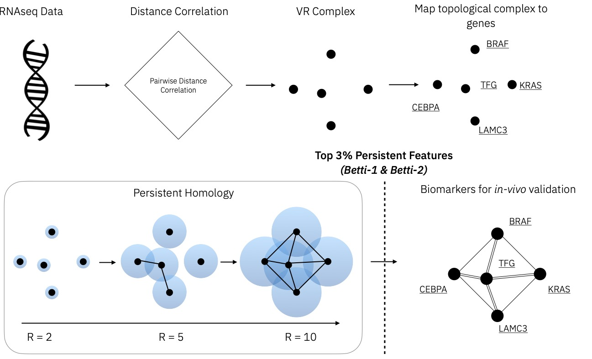

[](https://github.com/psf/black)


# WGTDA (Weighted Gene Topological Data Analysis)

Weighted Gene Topological Data Analysis (WGTDA) is a topological based framework to identify biomarkers for gene expression data. 



- WGTDA utilizes a set of computational topology techniques used to uncover the intricate local and global topological features of gene expression data.
- The technique converts gene expression data into a gene-gene correlation-based simplicial complex and employs persistent homology to identify topological interactions at different topological scales.
- The topological features that are the most persistent are identified as biomarkers.
- The paper documenting the WGTDA is presented here [WGTDA] (https://arxiv.org/abs/2402.08807)

## Getting Started
To install WGTDA:

1. Make sure that the python version you use in line with our [setup](setup.py) file, using a fresh environment is always a good idea:
    ```commandline
    conda create -n wgtda python=3.9 -y
    conda activate wgtda
    ```

2. Install the `main` branch to keep up to date with the latest supported features:
    ```commandline
    pip install git+https://github.com/IBM/WGTDA
    ```
## Contribution
Contributions to the WGTDA codebase are welcome!

## Usage 

### Code 

Have a look at the tutorial for more detailed usage of WGTDA [link to tutorial](tutorials/tutorial.ipynb)

```python 

#Import packages and WGTDA modules
import pandas as pd
import numpy as np
from wgtda.correlation import compute_distance_correlation_matrix, compute_wto_matrix
from wgtda.filters import extract_persistent_holes, remove_infinite_values
from wgtda import (construct_vr_complex_rna_matrix, interactions_dataframe, filter_genes, convert_gene_exp_to_array_and_dict)

# Load the gene expression data from a .pkl file
gene_expression_df = pd.read_pickle('../data/TCGA/BRCA.pkl')


# Filter the gene expression data using the gene list from cancer_genes.txt
gene_expression_filtered = filter_genes(gene_expression_df, '../data/preselection/cancer_genes.txt')

gene_expression_filtered_array, gene_dict = convert_gene_exp_to_array_and_dict(gene_expression_filtered)

# Compute the Distance Correlation matrix
distance_corr_matrix = compute_distance_correlation_matrix(gene_exp_arr=gene_expression_filtered_array) 

# Or Compute the Signed Weighted Topological Overlap (wTO) matrix
wto_matrix = compute_wto_matrix(gene_exp_arr=gene_expression_filtered_array)

persistence, rips_complex = construct_vr_complex_rna_matrix(distance_corr_matrix)
interactions = interactions_dataframe(persistence, rips_complex, gene_dict)
interactions = remove_infinite_values(interactions)
interactions.to_csv( "interactions.csv", index=True)
```

### Command-Line Interface
To use the tool via the command line, run the main.py script with the required arguments. Below are the command-line arguments supported by the tool:

--file_path or -p: The path to the gene expression data file. This argument is required.

--filter_genes_path or -fg: The path to a CSV file or txt file containing preselected genes. The tool will filter the dataset to include only these genes.

--output_path or -o: The path where the processed interactions CSV will be saved.

#### Filtering of topological features

--remove_infinite_values: -inf. Bool values. True  (Recommended) - if you want topological structures that tend to infinite  False - Keep topological structures that tend to infinite.

--filter_persistence: -fp Optional. A integer from 0-100 specifying the top percentage of values to extract from the 'lifespan' column. If provided, the tool will filter the dataset to include only these top values.

```commandline
python main.py --file_path data/TCGA/BRCA.pkl --filter_genes_path data/preselection/cancer_genes.csv --output_path output/interactions.csv --remove_infinite_values True
```

### Outputs (Topological Gene Interactions)

The output file contains the proposed biomarkers identified through the WGTDA analysis. Each row in this file represents a topological interaction between genes in $betti_0, betti_1, betti_2$ space. Betti numbers are used to differentiate topological spaces based on the connectivity of $n$-dimensional simplicial complexes. For example, $Betti_0$  corresponds to the number of connected components or clusters, $Betti_1$ represents the number of non-contractible loops or cycles, and $Betti_2$ indicates the number of voids or enclosed regions in the data space. 

In the context of topological features, the higher Betti numbers indicate a more complex topological structure with more independent cycles or voids. A higher Betti number suggests increased topological complexity, which may be associated with more intricate and robust biological processes. Furthermore, by focusing on these top persistent interactions, researchers can prioritize genes for further experimental validation and study, ultimately contributing to the understanding and manipulation of lifespan-associated pathways.

## Citation
If you use WGTDA for research, please consider citing the
reference paper:
```raw
@article{nyase2024wgtda,
  title={WGTDA: A Topological Perspective to Biomarker Discovery in Gene Expression Data},
  author={Nyase, Ndivhuwo and Mashatola, Lebohang and Kohlakala, Aviwe and Rhrissorrakrai, Kahn and Muller, Stephanie},
  journal={arXiv preprint arXiv:2402.08807},
  year={2024}
}
```
